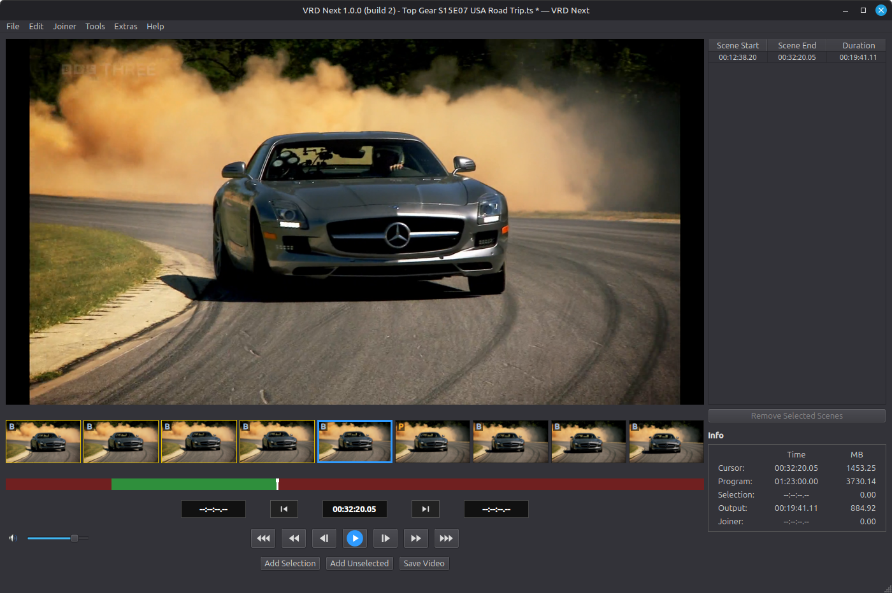
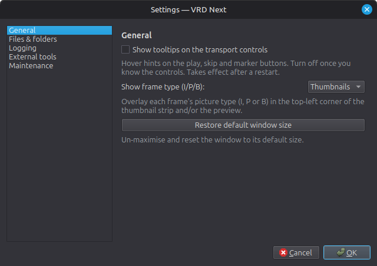
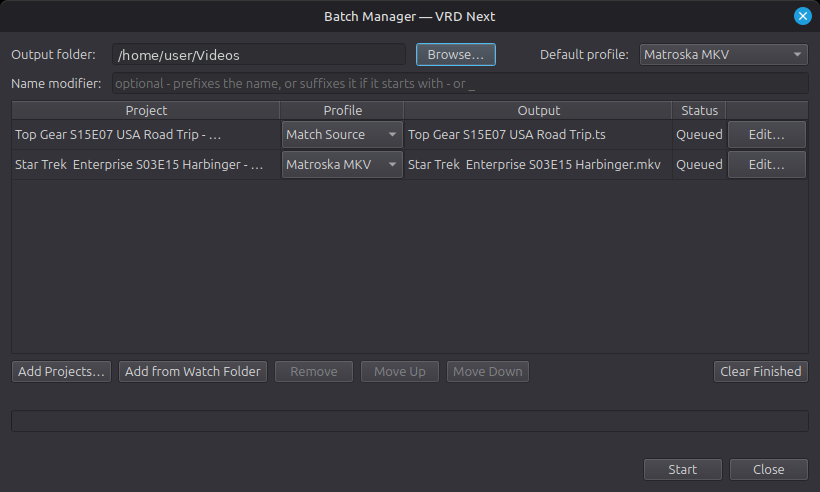

# VRD Next

**VRD Next is a lightweight, frame-accurate video cutter for Linux.** It focuses
on doing one thing well — fast, frame-accurate cuts of videos and PVR/broadcast
recordings without re-encoding — and takes its inspiration from VideoReDo,
distilling the part many people relied on most into a free, open-source tool.

<!-- SCREENSHOT: a shot of the main editor with a recording open goes well here.
     e.g.   -->

## Features

- **Frame-accurate cutting** of MPEG-TS and other recordings, copying the
  original streams so kept footage is never re-encoded.
- **Scene-based editing** with mark-in / mark-out, a thumbnail strip, and
  clickable thumbnails for fast navigation.
- **Lossless export**, including a broadcast-audio graft that copies the
  source audio losslessly rather than re-encoding it.
- **Automatic commercial detection** via Comskip, with the breaks turned into
  ready-to-review cuts.
- **A background Watcher** that scans your recording folders and prepares
  projects automatically, so they're waiting for you in the Batch Manager.
- **TV and Film renamers** that look titles up on TMDB and produce tidy,
  media-server-friendly names.
- **Project import/export** — reads and writes `.vprj` (V3/V5) and EDL files —
  plus a Quick Stream Fix remux to repair broken broadcast streams.
- **MKV output** via mkvmerge, alongside the native stream-copy export.

## Requirements

- **Linux.** Developed and tested on Linux Mint; other distributions should
  work but are less tested. Windows is untested but should run — see
  [Status](#status) for the caveats.
- **Python 3.10 or newer.**
- **Python packages:** PySide6, PyAV (`av`), numpy, bitstring, tqdm — see
  [`requirements.txt`](requirements.txt).
- **External tools:**
  - **ffmpeg** — required (PyAV builds against it for decoding/muxing).
  - **mkvmerge** (from MKVToolNix) — required only for MKV output.
  - **Comskip** — optional, for the Watcher's automatic commercial detection.
- **A TMDB API key** — optional, only needed for the TV/Film renamers. A free
  key is available from your account at themoviedb.org.

## Installation

```bash
git clone https://github.com/infidelus/vrd-next.git
cd vrd-next

# A virtual environment is recommended but not required:
python3 -m venv .venv
source .venv/bin/activate

pip install -r requirements.txt

python3 src/main.py
```

## Quick start

1. **Open a recording** with *Open Video* (or drag one in).
2. **Find your cuts.** Scrub the timeline, step frame-by-frame, and use the
   thumbnail strip to land exactly where you want.
3. **Mark scenes** with mark-in / mark-out to define what to keep (or let
   Comskip pre-mark the commercial breaks for you).
4. **Export.** The default export is a lossless, frame-accurate stream copy;
   choose MKV if you'd prefer that container.

Everything else lives in two places worth a look early on:

- **Settings** — set your working folders, point VRD Next at Comskip and
  mkvmerge, add your TMDB key, and adjust logging.
- **The Extras menu** — launch the TV/Film renamers and start the background
  Watcher.

## Screenshots

<!-- Drop a few images in here once you've taken them, for example:
  
  
  
-->

*(Screenshots to follow.)*

## Status

VRD Next was built for, and tested mainly against, UK Freeview HD and SD
recordings on Linux Mint — that's the path that's had the most real-world use.
Other sources and distributions may well work, but haven't been exercised as
thoroughly.

It hasn't been tested on Windows, but the core is cross-platform Python
(PySide6 and PyAV), so the editor and cutting should run there too. A couple of
Linux-only conveniences won't carry over — most notably the Watcher's
start-on-login — and on Windows the settings land in a `.config` folder under
your user profile rather than the usual location.

It's shared as-is, in the hope that others find it useful. The issue tracker is
turned off, and updates are likely to be occasional — chiefly theming support
and the odd bug fix. I dip into
[r/videoredo](https://www.reddit.com/r/videoredo/) now and then, but if you hit
a problem or want it to do more, the best thing you can do is **fork it and make
it your own** — exactly what the licence is here to allow.

## Acknowledgements

- Inspired by **VideoReDo**, the Windows tool that made frame-accurate
  recording cuts feel effortless.
- The frame-accurate cutting engine in `src/smartcut/` is **smartcut** by
  Santtu Keskinen (MIT licensed), used here with local modifications. See the
  original project at https://github.com/skeskinen/smartcut.
- With grateful acknowledgement to Anthropic's Claude, whose assistance shaped
  much of this project.

## Licence

VRD Next is released under the **MIT Licence** — see [`LICENSE`](LICENSE).

It bundles the smartcut engine, which is also MIT licensed (© 2024 Santtu
Keskinen); that licence is retained at `src/smartcut/LICENSE`.
